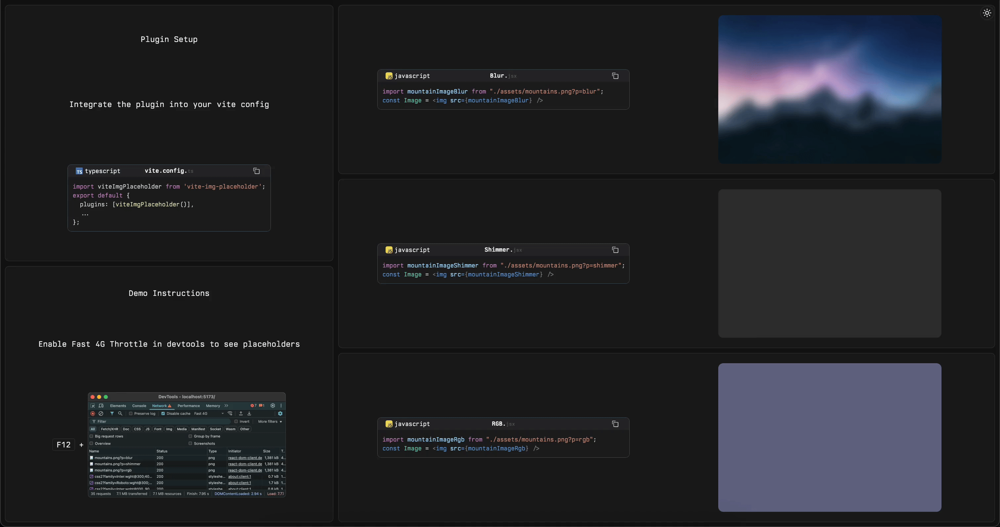

# @bebeal/vite-img-placeholder

Vite plugin for adding image placeholders with blur (low-res version), shimmer (animated effect), or RGB (samples dominant color from image) effects



## Install

```bash
yarn add @bebeal/vite-img-placeholder
```

## Usage

```tsx
import { imagePlaceholder } from '@bebeal/vite-img-placeholder'

// In your Vite config
export default defineConfig({
  plugins: [
    imagePlaceholder({ style: 'blur' }) //  opional style: 'blur' (default), 'shimmer', or 'rgb'
  ]
})
```

You can also specify the placeholder style per image using URL parameters:

```html

<!-- or with shorthand -->

```
